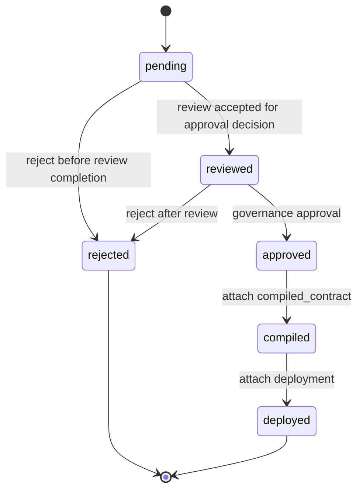

# Governance Lifecycle

Governance-Ledger models governance as deterministic state evolution.

Lifecycle state is explicit. Transitions are constrained. Operations that change state must use lifecycle transition semantics instead of mutating status fields directly.

## States

Valid review statuses:

```python
{
    "pending",
    "reviewed",
    "approved",
    "rejected",
    "compiled",
    "deployed",
}
```

## Allowed Transitions

```python
{
    "pending": {"reviewed", "rejected"},
    "reviewed": {"approved", "rejected"},
    "approved": {"compiled"},
    "compiled": {"deployed"},
    "rejected": set(),
    "deployed": set(),
}
```



## State Meaning

`pending`: A review artifact has been created but has not been reviewed.

`reviewed`: Extracted constraints and warnings have been inspected.

`approved`: Governance has been approved for deterministic compilation.

`rejected`: Governance was rejected. No further lifecycle transitions are allowed.

`compiled`: The approved review has been linked to an external compiled contract artifact.

`deployed`: The compiled contract has deployment provenance attached.

## Approval Semantics

Approval is a governance decision. It indicates that a human or governance process has accepted the extracted constraints and warnings.

Compiled contract linkage is forbidden unless the review is already `approved`.

## Compilation Semantics

Compilation is performed by the canonical CRI-CORE compiler, not Governance-Ledger.

Governance-Ledger records only:

```json
{
  "contract_id": "finance-core",
  "contract_version": "1.0.0",
  "contract_hash": "abc123"
}
```

Attaching compiled contract linkage transitions:

```text
approved -> compiled
```

## Deployment Semantics

Deployment requires:

- `review_status == "compiled"`
- existing `compiled_contract` linkage

Attaching deployment provenance transitions:

```text
compiled -> deployed
```

Deployment provenance records the environment, runtime, enforcement engine, engine version, deployer, and activation time.

## Rollback Semantics

Rollback restores governance state from a validated snapshot.

Rollback does not delete later history. It creates new provenance showing:

- current review state before rollback
- snapshot restored
- actor
- reason
- timestamp

This is closer to `git revert` than destructive undo.

## Terminal States

`rejected` and `deployed` are terminal in the basic lifecycle graph.

Further operations such as rollback are represented as provenance events rather than ordinary status transitions from `deployed`.
