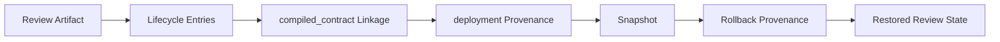

# Provenance

Governance-Ledger treats provenance as a first-class governance object.

The project is built around deterministic state evolution: every meaningful transformation should be inspectable, attributable, and reproducible.

## Deterministic Review IDs

When a caller does not provide `review_id`, the system derives one from normalized source text:

```text
review-<sha256-prefix>
```

This makes repeated review creation stable for the same source text.

## Review Provenance

Every review includes:

```json
{
  "review_id": "review-001",
  "created_at": "2026-05-07T20:14:00Z",
  "source_document": "finance_policy.txt",
  "review_status": "pending"
}
```

The timestamp records artifact creation. The review ID records deterministic identity when not supplied.

## Source Attribution

Detected constraints include `source_text` fragments.

This is critical because humans must be able to verify how governance text became structure.

Unsupported or ambiguous language becomes warnings. It is not silently dropped and not inferred into structure.

## Contract Linkage

Compiled contracts are external artifacts.

Governance-Ledger links only:

```json
{
  "contract_id": "finance-core",
  "contract_version": "1.0.0",
  "contract_hash": "abc123"
}
```

This keeps artifact boundaries clean:

- Governance-Ledger owns review provenance.
- The compiler owns compiled contract semantics.
- Runtime systems own enforcement behavior.

## Semantic Artifact Provenance

Semantic artifacts bind deterministic governance meaning to immutable inputs.

`governance_impact_preview.v1`, `authority_diff_impact.v1`, `governance_review_packet.v1`, and `authority_bundle.v1` are derived from structured artifacts rather than runtime evaluation.

Their provenance is based on:

- authority identity and contract hash
- publication manifest metadata
- preview, diff, and packet hashes
- authority lineage metadata
- schema compatibility metadata

`authority_bundle.v1` is the publishable governance object. It allows Cloud systems to ingest, validate, store, replay, and operate on a single context-rich object without reconstructing governance meaning.

Semantic provenance does not replace Guard admissibility provenance. It records Ledger-owned meaning, not runtime allow or block decisions.

## Snapshot Hashes

Snapshots hash the embedded review state using canonical JSON:

```text
json.dumps(review, sort_keys=True, separators=(",", ":"))
```

The snapshot hash is independent of snapshot creation time. Same review state, same snapshot hash.

Snapshot IDs derive from the snapshot hash:

```text
snapshot-<sha256-prefix>
```

## Rollback Lineage

Rollback validates snapshot integrity before restoring state.

Rollback does not overwrite history. It appends rollback provenance:

```json
{
  "from_snapshot": "snapshot-abc123",
  "rollback_actor": "ops-team",
  "rollback_reason": "restore approved governance",
  "rolled_back_at": "2026-05-07T22:00:00Z"
}
```

The restored review also records the current state it was rolled back from:

```json
{
  "rollback": {
    "from_review_id": "review-001",
    "from_review_status": "deployed",
    "to_snapshot_id": "snapshot-abc123",
    "to_review_id": "review-001",
    "to_review_status": "approved"
  }
}
```

This preserves lineage instead of pretending the later state never existed.

## Immutable-Style History

Most operations return copied objects and avoid mutating inputs.

That makes governance artifacts easier to audit, test, diff, snapshot, and restore.


