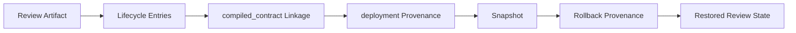

# Provenance

Governance-Ledger treats provenance as a first-class governance object.

The project is built around deterministic state evolution: every meaningful transformation should be inspectable, attributable, and reproducible.

## Deterministic Review IDs

When a caller does not provide `review_id`, the system derives one from normalized source text:

```text
review-<sha256-prefix>
```

This makes repeated review creation stable for the same source text.

## Review Provenance

Every review includes:

```json
{
  "review_id": "review-001",
  "created_at": "2026-05-07T20:14:00Z",
  "source_document": "finance_policy.txt",
  "review_status": "pending"
}
```

The timestamp records artifact creation. The review ID records deterministic identity when not supplied.

## Source Attribution

Detected constraints include `source_text` fragments.

This is critical because humans must be able to verify how governance text became structure.

Unsupported or ambiguous language becomes warnings. It is not silently dropped and not inferred into structure.

## Contract Linkage

Compiled contracts are external artifacts.

Governance-Ledger links only:

```json
{
  "contract_id": "finance-core",
  "contract_version": "1.0.0",
  "contract_hash": "abc123"
}
```

This keeps artifact boundaries clean:

- Governance-Ledger owns review provenance.
- The compiler owns compiled contract semantics.
- Runtime systems own enforcement behavior.

## Semantic Artifact Provenance

Semantic artifacts bind deterministic governance meaning to immutable inputs.

`governance_impact_preview.v1`, `authority_diff_impact.v1`, `governance_review_packet.v1`, and `authority_bundle.v1` are derived from structured artifacts rather than runtime evaluation.

Their provenance is based on:

- authority identity and contract hash
- publication manifest metadata
- preview, diff, and packet hashes
- authority lineage metadata
- schema compatibility metadata

`authority_bundle.v1` is the publishable governance object. It allows Cloud systems to ingest, validate, store, replay, and operate on a single context-rich object without reconstructing governance meaning.

Semantic provenance does not replace Guard admissibility provenance. It records Ledger-owned meaning, not runtime allow or block decisions.

## Customer-Policy Publication Provenance

The additive `customer_policy_provenance_complete_v1` profile preserves non-empty UTF-8 policy bytes as canonical base64 and hashes those bytes without whitespace or text normalization. Full-SHA-256-derived statements form an ordered, non-overlapping partition of the complete source. Each has exactly one final classification: `enforced`, `informational`, `unsupported`, or `requires_resolution`; complete publications contain no unresolved classification. Enforced statements alone map to confirmed semantic rules.

`interpret_customer_policy(...)` constructs that partition directly from exact bytes and applies only the documented v0.6 sentence grammar. It makes no model call and accepts no caller-supplied rules. `finalize_customer_policy_authority(...)` deterministically reconstructs the draft from the embedded canonical source bytes plus source and authority identities before applying bounded resolutions. A caller-modified span, classification, rule, mapping, identity, or draft hash therefore cannot enter the publication chain.

A draft with no supported rule remains truthful provenance evidence but is not finalizable. At least one enforceable confirmed rule must survive resolution; Ledger does not synthesize default authorization semantics. Safely removable recognized ambiguity modifiers may expose one interpreter-produced enforcement option, while unsafe ambiguity remains limited to non-enforcement choices. Resolution order is preserved, and publication chronology binds every resolution at or before approval, approval at or before commit, and commit at or before publication.

Resolution records are canonical audit objects binding an ambiguity identity, full resolution identity, referenced statement identities, selected decision or meaning, resolver, and UTC resolution time. Canonical JSON SHA-256 hashes bind the statement set, mappings, complete resolution record set, approval record, semantic commit, compiled contract, authority identity, version relationship, bundle, and receipt. The short-policy profile limits inputs to 240 KiB of decoded source, 2,048 statements, 1,024 mappings, and 1,024 resolutions.

Source-policy revision and published-authority version remain separate. Their unambiguous `source_policy_ref` and `authority_ref` are connected through the canonical, hash-verified `publishes_as` version binding.

The complete chain is exact source bytes and identity, stable statements and spans, statement-to-rule mappings, bounded resolutions, approval, semantic commit, canonical compiler input and contract, authority identity, authority bundle, then receipt. Approval attests the semantic commit, which already binds final classifications, mappings, resolutions, and confirmed rules. Identical complete inputs reproduce every hash; any changed bound input invalidates verification.

An older `authority_bundle.v1` that lacks the profile remains readable but is classified as `legacy_provenance_incomplete`. Ledger never fills historical gaps with inferred lineage.

## Domain-Pack Policy Provenance

The deterministic domain-pack workflow preserves the released v1 artifacts above and emits native `authority_bundle.v2` plus `publication_receipt.v2` artifacts. The v2 bundle directly binds exact source bytes and ordered statement spans to either a direct pack parse or exact `policy_mapping_decision.v1`, canonical controlled-language previews, `constraint_ir.v1`, the selected `runtime_fact_schema.v1`, exact `domain_pack.v1` identity/version/hash, semantic commit, standalone `compiled_authority_contract.v2`, authority identity/version, approval, publication manifest, and complete provenance bindings. The v2 compiled contract has a distinct schema identity and current repository-only surface; it does not reuse the structurally different released v1 schema identity.

No v1 artifact is embedded in v2 and no released schema is reinterpreted. The public authority and receipt validators dispatch by schema version: v1 validation is unchanged, while v2 validation reconstructs and cross-checks the complete chain. A byte-only source change may preserve the released semantic-meaning hash while changing the semantic commit's full bundle hash, compiled lineage, v2 bundle, and receipt.

Every unmatched nonempty statement stays pending until an explicit human disposition. Enforced decisions bind one pack control, its bounded selection, full typed meaning, required runtime facts, and generated constraint. Informational and unsupported decisions bind a bounded reason but no fake enforcement fields. All decisions bind mapper identity, canonical UTC time, source document hash, statement ID/span, exact pack reference, and decision hash. Finalization reconstructs and replays them; it neither infers arbitrary prose nor accepts caller-authored rule objects.

## Snapshot Hashes

Snapshots hash the embedded review state using canonical JSON:

```text
json.dumps(review, sort_keys=True, separators=(",", ":"))
```

The snapshot hash is independent of snapshot creation time. Same review state, same snapshot hash.

Snapshot IDs derive from the snapshot hash:

```text
snapshot-<sha256-prefix>
```

## Rollback Lineage

Rollback validates snapshot integrity before restoring state.

Rollback does not overwrite history. It appends rollback provenance:

```json
{
  "from_snapshot": "snapshot-abc123",
  "rollback_actor": "ops-team",
  "rollback_reason": "restore approved governance",
  "rolled_back_at": "2026-05-07T22:00:00Z"
}
```

The restored review also records the current state it was rolled back from:

```json
{
  "rollback": {
    "from_review_id": "review-001",
    "from_review_status": "deployed",
    "to_snapshot_id": "snapshot-abc123",
    "to_review_id": "review-001",
    "to_review_status": "approved"
  }
}
```

This preserves lineage instead of pretending the later state never existed.

## Immutable-Style History

Most operations return copied objects and avoid mutating inputs.

That makes governance artifacts easier to audit, test, diff, snapshot, and restore.


```mermaid
flowchart LR
    A["Review Artifact"] --> B["Lifecycle Entries"]
    B --> C["compiled_contract Linkage"]
    C --> D["deployment Provenance"]
    D --> E["Snapshot"]
    E --> F["Rollback Provenance"]
    F --> G["Restored Review State"]
```
