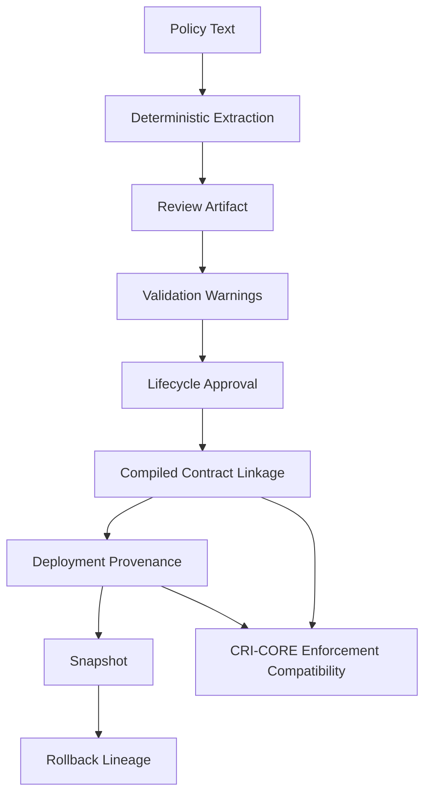
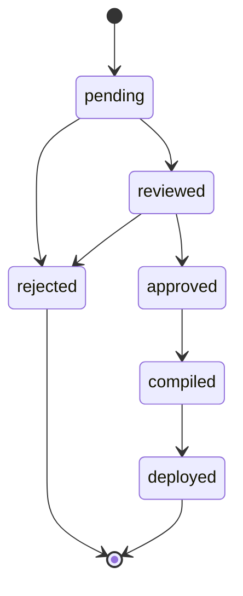

# Governance-Ledger

Governance-Ledger is a deterministic governance operationalization layer for transforming human governance text into traceable, reviewable, executable governance artifacts compatible with CRI-CORE enforcement systems.

The core idea is simple:

```text
governance as deterministic state evolution
```

Policy language enters as text. The system extracts only supported governance primitives, emits reviewable provenance, surfaces unsupported language as warnings, tracks lifecycle state, links externally compiled contracts, records deployment lineage, and creates deterministic snapshots for audit and rollback.

## What It Does

- Deterministic extraction of supported governance constraints.
- Structured review artifacts with source text attribution.
- Authoring validation with explicit warnings.
- Lifecycle transitions for review, approval, compilation, and deployment.
- Lightweight compiled contract linkage by identity, version, and hash.
- Deployment provenance for runtime lineage.
- Deterministic snapshots of governance state.
- Rollback lineage that restores from snapshots without erasing history.
- Governance diffs across review versions, warnings, and deployments.

## What It Is Not

Governance-Ledger is not:

- An AI governance engine.
- Autonomous policy reasoning.
- Runtime enforcement.
- Semantic governance inference.
- Legal interpretation AI.
- A replacement for human governance ownership.
- A runtime admissibility evaluator.
- A system that executes mutations.

It does not infer unsupported governance meaning. If language is unsupported or ambiguous, it becomes a warning instead of hidden structure.

## Architecture

```text
Policy Text
    |
    v
Extraction
    |
    v
Review Artifact
    |
    v
Validation Warnings
    |
    v
Lifecycle Approval
    |
    v
Compiled Contract Linkage
    |
    v
Deployment Provenance
    |
    v
Snapshot / Rollback
    |
    v
CRI-CORE Enforcement Compatibility
```





Governance-Ledger produces upstream governance objects. The canonical CRI-CORE compiler remains the authority for compiled contract semantics.

## Supported v0.1 Primitives

Role requirement:

```text
Only managers may approve transfers.
```

Structured output:

```json
{
  "authority": {
    "required_roles": ["managers"]
  }
}
```

Separation of duties:

```text
Proposer and approver must be separate.
```

Structured output:

```json
{
  "invariants": {
    "separation_of_duties": true
  }
}
```

Transfer threshold:

```text
Transfers above $1M require manager approval.
```

Structured output:

```json
{
  "approvals": {
    "thresholds": {
      "transfer_funds": 1000000
    }
  }
}
```

## Review Artifacts

Review artifacts explain what was detected and where it came from:

```json
{
  "review_id": "review-001",
  "created_at": "2026-05-07T20:14:00Z",
  "source_document": "finance_policy.txt",
  "review_status": "pending",
  "detected_constraints": [
    {
      "type": "required_role",
      "value": "manager",
      "source_text": "require manager approval"
    }
  ],
  "warnings": []
}
```

## Why Unsupported Governance Becomes Warnings

Unsupported governance language must not silently disappear, and it must not be guessed into executable structure.

For example:

```text
Transfers require reasonable approval timing.
```

This becomes:

```json
{
  "warnings": [
    {
      "type": "unsupported_constraint",
      "text": "reasonable approval timing"
    }
  ]
}
```

That preserves auditability. A human reviewer can decide whether to rewrite, approve, reject, or extend the deterministic extraction rules.

## Basic Usage

```python
from governance_ledger import (
    attach_compiled_contract,
    attach_deployment,
    create_snapshot,
    extract_constraints,
    review_constraints,
    transition_review_status,
)

text = """
Transfers above $1M require manager approval.
Proposer and approver must be separate.
"""

policy = extract_constraints(text)
review = review_constraints(text, source_document="finance_policy.txt")

review = transition_review_status(review, "reviewed", actor="governance-team")
review = transition_review_status(review, "approved", actor="governance-team")

review = attach_compiled_contract(
    review,
    {
        "contract_id": "finance-core",
        "contract_version": "1.0.0",
        "contract_hash": "abc123",
    },
    actor="compiler-service",
)

review = attach_deployment(
    review,
    environment="production",
    runtime="waveframe-guard",
    deployed_by="ops-team",
    enforcement_engine_version="0.12.0",
)

snapshot = create_snapshot(review)
```

## Operational Workflow

Primary repository layout:

```text
policies/     source governance text
generated/    extraction and validation drafts
reviews/      pending, approved, and deployed review artifacts
contracts/    runtime contract artifacts only
snapshots/    deterministic governance snapshots
```

Draft generation reads policy text from `policies/` and writes machine-generated constraints plus pending review artifacts:

```powershell
governance-ledger run policies/
```

Draft output:

- `generated/<policy>.generated.json`
- `generated/<policy>.validation.json`
- `reviews/<policy>.review.json`

Draft generation does not approve, compile, deploy, publish, or create runtime contracts.

Human approval is explicit:

```powershell
governance-ledger approve reviews/finance_policy.review.json --actor governance-team
```

Publishing requires an approved review:

```powershell
governance-ledger publish reviews/finance_policy.review.json
```

Publish output:

- `contracts/<contract-id>-<version>.contract.json`
- `contracts/<policy>.publication_manifest.json`
- `reviews/<policy>.deployed.review.json`
- `snapshots/<snapshot-id>.json`

Runtime contracts should only exist in `contracts/`. They should not be written to `generated/`, `reviews/`, or `policies/`.

Generated validation artifacts include warning severity. CI can block publication workflows with:

```powershell
governance-ledger check generated
```

The check fails when any generated validation artifact contains `severity == "error"`.

## Documentation

- [GOVERNANCE_OBJECT_MODEL.md](GOVERNANCE_OBJECT_MODEL.md)
- [LIFECYCLE.md](LIFECYCLE.md)
- [PROVENANCE.md](PROVENANCE.md)
- [NON_GOALS.md](NON_GOALS.md)
- [schemas/](schemas/)
